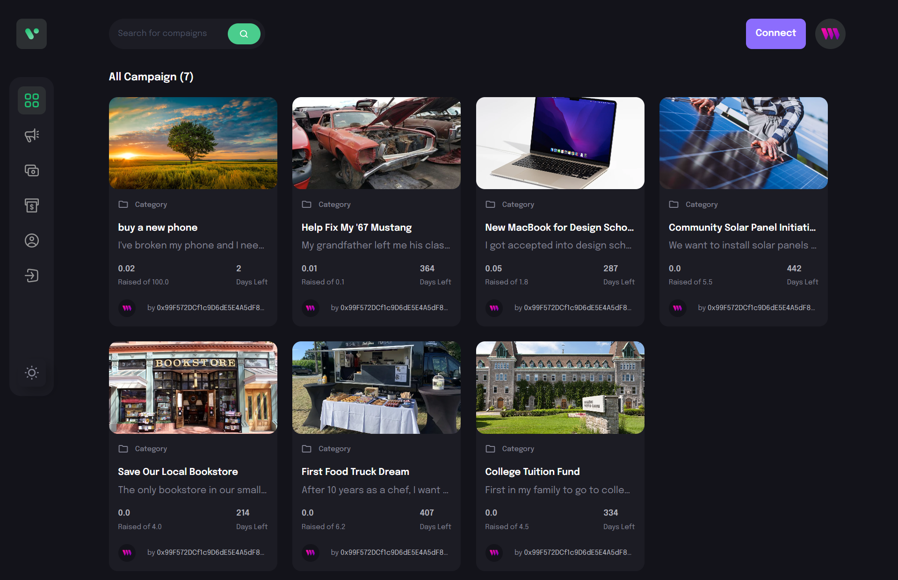
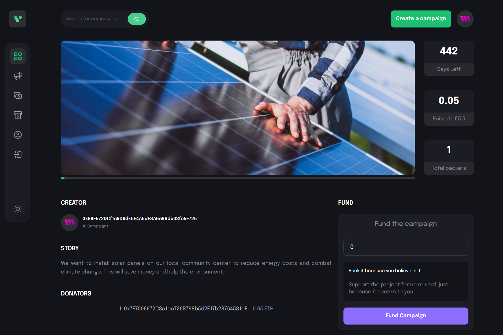
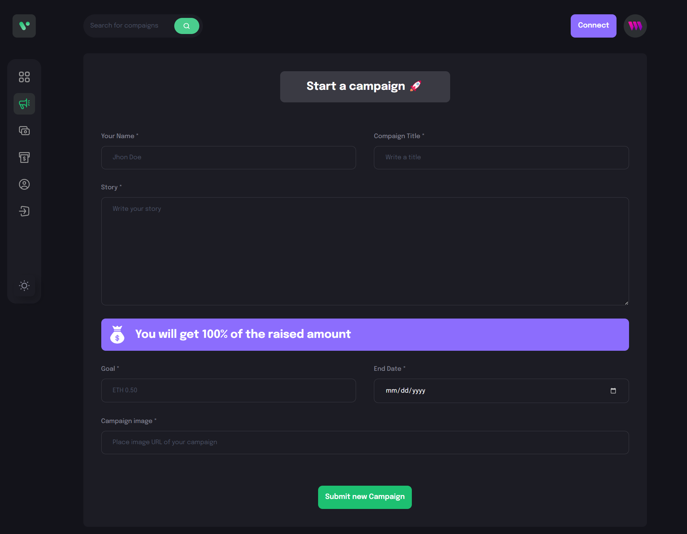

# Crowdfunder
CrowdFunder is a decentralized web3 crowdfunding platform built with ReactJS, Vite, and Tailwind CSS. It enables users to create and support funding campaigns on the Ethereum blockchain using MetaMask for secure wallet connectivity. The app leverages thirdweb APIs to simplify blockchain interactions and smart contract management.

## Features
- **Ethereum Funding**: Enable secure, Ethereum-based donations with MetaMask integration.
- **Smart Contracts**: Create, manage, and view campaigns through deployed smart contracts.
- **Thirdweb API Integration**: Simplifies blockchain operations with efficient API support.
- **Decentralized Hosting**: Hosted on Netlify, ensuring a fast and reliable deployment.

## ScreenShots
Here are some screenshots showcasing the app:
| Feature            | Screenshot                              |
|--------------------|-----------------------------------------|
| **Home Screen**    |  |
| **Campaign Details** |  |
| **Create Campaign** |  |

## Prerequisites
Before you begin, ensure you have met the following requirements:

You have installed the latest version of [Node.js and npm](https://nodejs.org/en/download/)

## Installation
1. Clone the repository:
   ```
   git clone https://github.com/hamdoudhakem/Crowdfunding.git
   ```
2. Navigate to the project directory:
   ```
   cd Crowdfunding
   ```
3. Install dependencies:
   ```
   yarn install
   ```

## Usage
Start the app by running:
```
yarn dev
```

## Troubleshooting
If you encounter a problem when loading the Campaigns, try the following:
1. Ensure you have an active internet connection.
2. Try refreshing the page by pulling down on the screen.

If you encounter any problem, please open an issue on the GitHub repository with details about the problem you're experiencing.

## Contributing

Contributions to CrowdFunder are welcome. Please feel free to submit a Pull Request.

## License

This project is licensed under the MIT License.

## Contact

If you want to contact me, you can reach me at hakemhamdoud8@gmail.com.
